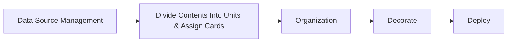
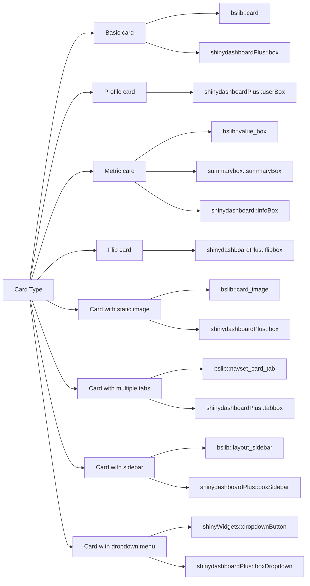

# R Shiny Card Based Design

> [!SOURCE] Sources:
> - *[[05-SYSTEM/Documents/PDFs/RShiny-CardBasedDesign.pdf|RShiny-CardBasedDesign]]*

```table-of-contents
title: ## Contents 
style: nestedList # TOC style (nestedList|inlineFirstLevel)
minLevel: 1 # Include headings from the specified level
maxLevel: 4 # Include headings up to the specified level
includeLinks: true # Make headings clickable
debugInConsole: false # Print debug info in Obsidian console
```

## Overview

> [!NOTE] About
> This note summarizes the concepts introduced in a published PDF: [[05-SYSTEM/Documents/PDFs/RShiny-CardBasedDesign.pdf|RShiny-CardBasedDesign]].

The document describes using a card-based design for building dashboards in [[04-RESOURCES/Tools/Tool - R Shiny|R Shiny]]. Card-based design, adopted by companies like Apple and Google, helps create an intuitive and organized [[04-RESOURCES/Definitions/Acronyms/User Experience (UX)|User Experience (UX)]]. The article explains the steps to develop such a design in R Shiny, focusing on:

1. **Data Source Management:** Understanding the data and identifying analysis subjects to guide the application's content.
    
2. **Divide Contents into Units & Assign Cards:** Classify data into units and select appropriate card types for visualization. It introduces various card types such as basic cards, cards with multiple tabs, cards with sidebars, and user info cards. The article emphasizes using the [[04-RESOURCES/Tools/Tool - R bslib|{bslib}]] package first for card creation and then exploring others like [[04-RESOURCES/Tools/Tool - R shinydashboardPlus|{shinydashboardPlus}]] if needed.
    
3. **Organization:** Discusses creating the layout for a card-based app using [[04-RESOURCES/Tools/Tool - R Shiny|R Shiny]]'s native layout functions for stability and compatibility. It presents two main layout functions:
    
    - `fluidRow` from [[04-RESOURCES/Tools/Tool - R Shiny|{shiny}]] for arranging cards in rows using a 12-column grid system.
    - `layout_column_wrap` from [[04-RESOURCES/Tools/Tool - R bslib|{bslib}]] for automatically distributing cards across rows.
4. **Decorate:** Talks about enhancing the dashboard with themes and icons using the [[04-RESOURCES/Tools/Tool - R bslib|{bslib}]] package for theme adjustments. It highlights how to change themes easily with `bs_theme()` and the inclusion of icons using [[Tool - FontAwesome|FontAwesome]].
    
5. **Conclusion:** Recommends using native Shiny functions for layouts and [[04-RESOURCES/Tools/Tool - R bslib|{bslib}]] for card design, decorating with themes, and icons. It also suggests mastering [[04-RESOURCES/Definitions/Acronyms/Cascading Style Sheets (CSS)|CSS]] and [[04-RESOURCES/Code/JavaScript/_README|JavaScript]] for further customization.

The paper provides practical guidance for creating polished, professional dashboards in R Shiny without requiring advanced front-end development skills.

## Diagrams





## Resources

***

## Appendix

*Note created on [[2024-09-30]] and last modified on [[2024-09-30]].*

### See Also

- 

### Backlinks

```dataview
LIST FROM [[R Shiny Card Based Design]] AND -"CHANGELOG" AND -"//R Shiny Card Based Design"
```

***

(c) [No Clocks, LLC](https://github.com/noclocks) | 2024