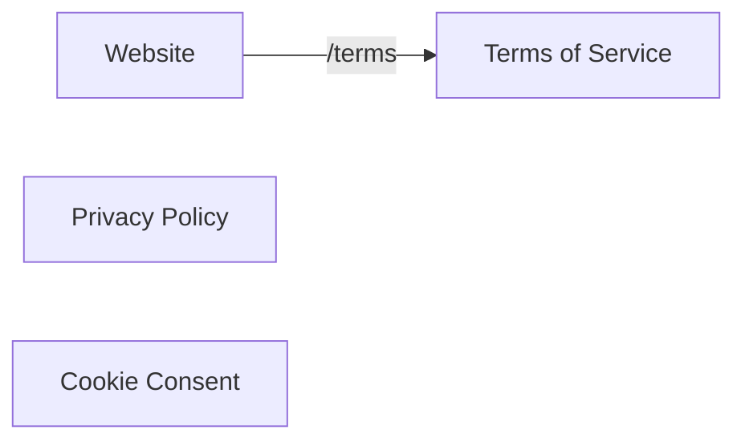

# Legal Policies Checklist

```table-of-contents
title: Contents 
style: nestedList # TOC style (nestedList|inlineFirstLevel)
minLevel: 1 # Include headings from the specified level
maxLevel: 4 # Include headings up to the specified level
includeLinks: true # Make headings clickable
debugInConsole: false # Print debug info in Obsidian console
```

## Overview

> [!SOURCE] Sources:
> - **

## Diagram



## Checklist

### Step 1

## Conclusion

***

## Appendix

*Note created on [[2024-04-01]] and last modified on [[2024-04-01]].*

### Backlinks

```dataview
LIST FROM [[Checklist - Legal Policies]] AND -"CHANGELOG" AND -"03-AREAS/Business/Checklists/Checklist - Legal Policies"
```

***

(c) [No Clocks, LLC](https://github.com/noclocks) | 2024
