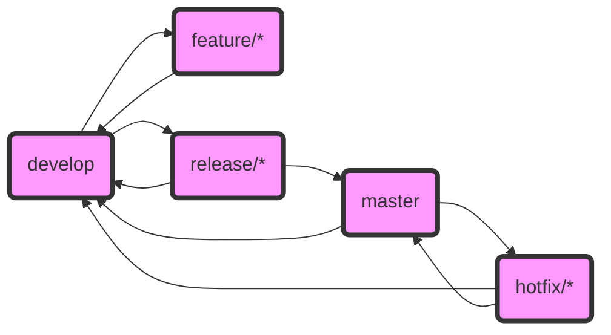

# Git Flow Model Diagram.

#### You:
<time datetime="2024-03-15T18:09:00.046Z" title="3/15/2024, 2:09:00 PM">02:09 PM</time>

git flow branching model diagram

#### ChatGPT:
<time datetime="2024-03-15T18:09:21.291Z" title="3/15/2024, 2:09:21 PM">02:09 PM</time>

To create a Mermaid flowchart for the Git Flow branching model, we'll illustrate the key branches and their interactions. Git Flow involves several branches for managing different aspects of development, including `feature`, `develop`, `release`, `hotfix`, and `master`. Here's how you can depict it using Mermaid syntax:

In this flowchart:

- Development begins from the `develop` branch.
- Feature branches (`feature/*`) are created from `develop` for new features and merged back into `develop` once completed.
- When it's time for a release, a `release/*` branch is created from `develop`. Modifications for the release are made in the `release/*` branch. After the release is finalized, it's merged into both `develop` and `master`.
- Hotfixes (`hotfix/*`) are created from `master` to quickly address issues in production. Once completed, they are merged back into both `master` and `develop`.
- The `master` branch holds the official release history.

This diagram simplifies the Git Flow process, visually representing the branch strategies and merges that are typical in this model.
