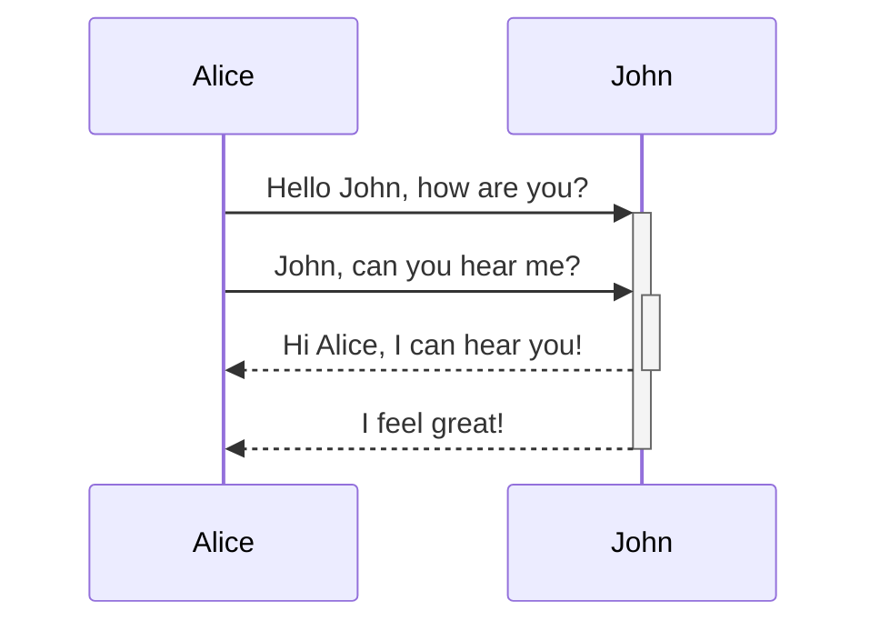

# Obsidian Markdown Syntax Cheat Sheet

> [!SOURCE] Sources:
> - *[Custom Markdown cheatsheet for the note-taking app Obsidian](https://gist.github.com/JulianGR/f33bcd5c52785757851db4569c09f99d)*

## Useful Shortcuts

- `Ctrl + N`: new note
- `Ctrl + E`: toggle edit mode
- `Ctrl + enter`: toggle checkbox
- `Ctrl + shift + F`: search among all files
- `Ctrl + P`: command pannel
- `Ctrl + [ or ]` : change indentation of a list item
- `Alt + click` to make multiple cursos

### Internal Linking

```markdown
Link to a page: [[Internal link]].
```

Link to a page: [[Internal link]].

---

### Embeds

Embed another file (read more about [[Embed files]]). Here's an embedded section:

```md
![[Obsidian#What is Obsidian]]
```

![[Obsidian#What is Obsidian]]

---

### Headers

```md
# This is a heading 1
## This is a heading 2
### This is a heading 3 
#### This is a heading 4
##### This is a heading 5
###### This is a heading 6
```

# This is a heading 1
## This is a heading 2
### This is a heading 3 
#### This is a heading 4
##### This is a heading 5
###### This is a heading 6

---

### Emphasis

```md
*This text will be italic*
_This will also be italic_
```

*This text will be italic*
_This will also be italic_

```md
**This text will be bold**
__This will also be bold__
```

**This text will be bold**
__This will also be bold__

```md
_You **can** combine them_
```

_You **can** combine them_

```md
text `Inline Code` text		
~~Mistaken text.~~	
<ins>Underline</ins>
```

text `Inline Code` text		
~~Mistaken text.~~	
<ins>Underline</ins>

```md
<center>This text is centered.</center>
<p style="text-align:center">Center this text</p>
<font color="red">This text is red!</font>
<p style="color:blue">Make this text blue.</p>
[This is a comment that will be hidden.]: # 
:warning: **Warning:** Do not push the big red button.
> :warning: **Warning:** Do not push the big red button.
```

<center>This text is centered.</center>
<p style="text-align:center">Center this text</p>
<font color="red">This text is red!</font>
<p style="color:blue">Make this text blue.</p>
[This is a comment that will be hidden.]: # 
⚠ **Warning:** Do not push the big red button.
> ⚠ **Warning:** Do not push the big red button.

More emojis: https://gist.github.com/rxaviers/7360908

### Highlighting

```md
Use two equal signs to ==highlight text==.
```

Use two equal signs to ==highlight text==.

---

### Lists

```md
+ Item 1
+ Item 2
  + Item 2a
  - Item 2b
  - Item 2c

Tasks
- [ ] a task list item
- [ ] incomplete
- [x] completed

1. Item 1
1. Item 2
1. Item 3
   1. Item 3a
   1. Item 3b
```

+ Item 1
+ Item 2
  + Item 2a
  - Item 2b
  - Item 2c

Tasks
- [ ] a task list item
- [ ] incomplete
- [x] completed

1. Item 1
1. Item 2
1. Item 3
   1. Item 3a
   1. Item 3b

--- 

### Images

```md

```


#### Resizing images

Example of this above image resized to 100 pixels wide:

```md

```


#### Reference style

```
Reference-style: 
![alt text][logo]

[logo]: https://history-computer.com/ModernComputer/Basis/images/Engelbart.jpg "Logo Title Text 2"
```

Reference-style: 
![alt text][logo]

[logo]: https://history-computer.com/ModernComputer/Basis/images/Engelbart.jpg "Logo Title Text 2"

#### With caption

```
<figure>
    
    <figcaption>A single track trail outside of Albuquerque, New Mexico.</figcaption>
</figure>
```
<figure>
    
    <figcaption>A single track trail outside of Albuquerque, New Mexico.</figcaption>
</figure>
---

### Links

#### External links

Markdown style links can be used to refer to either external objects, such as web pages, or an internal page or image.

```md
http://obsidian.md - automatic!
[Obsidian](http://obsidian.md)
```

http://obsidian.md - automatic!
[Obsidian](http://obsidian.md)

#### Obsidian URI links

[[Using obsidian URI|Obsidian URI]] links can be used to open notes in Obsidian either from another Obsidian vault or another program.

For example, you can link to a file in a vault like so (please note the [[Using obsidian URI#Encoding|required encoding]]):

```md
[Link to note](obsidian://open?path=D:%2Fpath%2Fto%2Ffile.md)
```

[Link to note](obsidian://open?path=D:%2Fpath%2Fto%2Ffile.md)

You can link to a note by its vault name and file name instead of path as well:

```md
[Link to note](obsidian://open?vault=MainVault&file=MyNote.md)
```

[Link to note](obsidian://open?vault=MainVault&file=MyNote.md)

### Reference Links

```md
[You can use numbers for reference-style link definitions][1]

Or leave it empty and use the [link text itself][]

[1]: http://slashdot.org
[link text itself]: http://www.reddit.com
```


[You can use numbers for reference-style link definitions][1]

Or leave it empty and use the [link text itself][]

[1]: http://slashdot.org
[link text itself]: http://www.reddit.com


#### Escaping

If there are spaces in the url, they can be escaped by either using `%20` as a space, such as:

```md
[Export options](Pasted%20image)
```

[Export options](Pasted%20image)

Or you can enclose the target in `<>`, such as:

```md
[Slides Demo](<Slides Demo>)
```

[Slides Demo](<Slides Demo>)

---
### Videos

- Copy the iframe of youtube and paste it

or...

They can't be added directly but you can add an image with a link to the video like this:

```no-highlight
<a href="http://www.youtube.com/watch?feature=player_embedded&v=YOUTUBE_VIDEO_ID_HERE
" target="_blank"></a>

Or, in pure Markdown, but losing the image sizing and border:
[](http://www.youtube.com/watch?v=YOUTUBE_VIDEO_ID_HERE)

```

<a href="http://www.youtube.com/watch?feature=player_embedded&v=dQw4w9WgXcQ
" target="_blank"></a>

Or, in pure Markdown, but losing the image sizing and border:
[](http://www.youtube.com/watch?v=dQw4w9WgXcQ)

---

### Blockquotes

```md
> Human beings face ever more complex and urgent problems, and their effectiveness in dealing with these problems is a matter that is critical to the stability and continued progress of society.

\- Doug Engelbart, 1961
```

> Human beings face ever more complex and urgent problems, and their effectiveness in dealing with these problems is a matter that is critical to the stability and continued progress of society.

\- Doug Engelbart, 1961

---

### Inline code

```md
Text inside `backticks` on a line will be formatted like code.
```

Text inside `backticks` on a line will be formatted like code. 

---

### Code blocks

Syntax highlight is supported with the language specified after the first set of backticks. We use prismjs for syntax highlighting, a list of supported languages can be found [at their site](https://prismjs.com/#supported-languages)

<pre><code>```js
function fancyAlert(arg) {
  if(arg) {
    $.facebox({div:'#foo'})
  }
}
```</code></pre>

```js
function fancyAlert(arg) {
  if(arg) {
    $.facebox({div:'#foo'})
  }
}
```
    
	
```md
    Text indented with a tab is formatted like this, and will also look like a code block in preview. 
```

    Text indented with a tab is formatted like this, and will also look like a code block in preview. 
    
---

### Tables

You can create tables by assembling a list of words and dividing them with hyphens `-` (for the first row), and then separating each column with a pipe `|`:

```md
First Header | Second Header
------------ | ------------
Content from cell 1 | Content from cell 2
Content in the first column | Content in the second column
```

First Header | Second Header
------------ | ------------
Content from cell 1 | Content from cell 2
Content in the first column | Content in the second column

---

```md
Tables can be justified with a colon | Another example with a long title
:----------------|-------------:
because of the `:` | these will be justified

If you put links in tables, they will work, but if you use Piped Links, the pipe must be escaped with a `\` to prevent it being read as a table element.
```

Tables can be justified with a colon | Another example with a long title
:----------------|-------------:
because of the `:` | these will be justified

If you put links in tables, they will work, but if you use Piped Links, the pipe must be escaped with a `\` to prevent it being read as a table element.

```md
First Header | Second Header
------------ | ------------
[[Format your notes\|Formatting]]	|  [[Keyboard shortcuts\|hotkeys]]
```

First Header | Second Header
------------ | ------------
[[Format your notes\|Formatting]]	|  [[Use hotkeys\|hotkeys]]	

---

### Footnotes

```md
Here's a simple footnote,[^1] and here's a longer one.[^bignote]

[^1]: meaningful!

[^bignote]: Here's one with multiple paragraphs and code.

    Indent paragraphs to include them in the footnote.

    `{ my code }`

    Add as many paragraphs as you like.
```

Here's a simple footnote,[^1] and here's a longer one.[^bignote]

[^1]: meaningful!

[^bignote]: Here's one with multiple paragraphs and code.

    Indent paragraphs to include them in the footnote.

    `{ my code }`

    Add as many paragraphs as you like.
	
```md
You can also use inline footnotes. ^[notice that the carat goes outside of the brackets on this one.]
```

You can also use inline footnotes. ^[notice that the carat goes outside of the brackets on this one.]

### Math

```md
$$\begin{vmatrix}a & b\\
c & d
\end{vmatrix}=ad-bc$$
```

$$\begin{vmatrix}a & b\\
c & d
\end{vmatrix}=ad-bc$$

You can also do inline math like $e^{2i\pi} = 1$ .

Obsidian uses [Mathjax](http://docs.mathjax.org/en/latest/basic/mathjax.html). You can check which packages are supported in Mathjax [here](http://docs.mathjax.org/en/latest/input/tex/extensions/index.html).

### Comments

Use `%%` to enclose comments, which will be parsed as Markdown, but will not show up in the preview.

```md
Here is some inline comments: %%You can't see this text%% (Can't see it)

Here is a block comment:
%%
It can span
multiple lines
%%
```

Here is some inline comments: %%You can't see this text%% (can't see it in preview)

Here is a block comment: (can't see it in preview either)
%%
It can span
multiple lines
%%

### Diagram

Obsidian uses [Mermaid](https://mermaid-js.github.io/) to render diagrams and charts. Mermaid also provides [a helpful live editor](https://mermaid-js.github.io/mermaid-live-editor).

<pre><code>```mermaid
sequenceDiagram
    Alice->>+John: Hello John, how are you?
    Alice->>+John: John, can you hear me?
    John-->>-Alice: Hi Alice, I can hear you!
    John-->>-Alice: I feel great!
```</code></pre>



Obsidian supports linking to notes in Mermaid:
<pre><code>```mermaid
graph TD

Biology --> Chemistry

class Biology,Chemistry internal-link;
```</code></pre>

An easier way to do it is the following: ^376b9d
<pre><code>```mermaid
graph TD

A[Biology]
B[Chemistry]

A --> B

class A,B,C,D,E,F,G,H,I,J,K,L,M,N,O,P,Q,R,S,T,U,V,W,X,Y,Z internal-link;
```</code></pre>

This way, all the note names (at least until `Z[note name]`) are all automatically assigned the class `internal-link` when you use this snippet.

If you use special characters in your note names, you need to put the note name in double quotes.
`"⨳ special character"`
It looks like this if you follow the [[Format your notes#^376b9d|second option]]:
`A["⨳ special character"]`