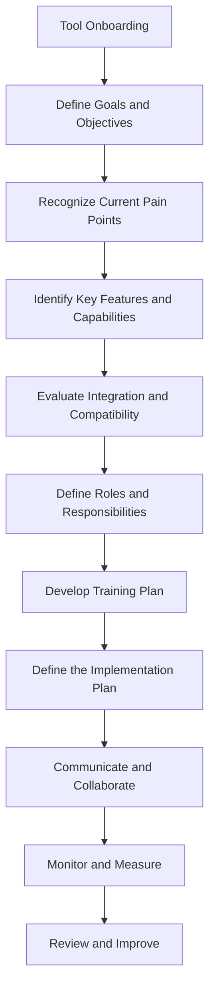

# Tool Onboarding Checklist

```table-of-contents
title: Contents 
style: nestedList # TOC style (nestedList|inlineFirstLevel)
minLevel: 1 # Include headings from the specified level
maxLevel: 4 # Include headings up to the specified level
includeLinks: true # Make headings clickable
debugInConsole: false # Print debug info in Obsidian console
```

## Overview

> [!NOTE]
> *Onboarding any new tool can be challenging, and every team has unique dynamics, priorities, and work flows—making misalignment and disconnection common pitfalls. This checklist is designed to help you onboard a new tool in a way that minimizes disruption and maximizes the value of the new tool.*

## Diagram




## Checklist

### Define Goals and Objectives

- [ ] Define the goals and objectives for the new tool.
- [ ] Identify the key stakeholders and decision makers.
- [ ] Define the success criteria for the new tool.

### Recognize Current Pain Points

- [ ] Identify the current pain points and challenges.
- [ ] Identify the current tools and processes that are causing the pain points.

### Identify Key Features and Capabilities

- [ ] Identify the key features and capabilities of the new tool.
- [ ] Identify the key features and capabilities that are missing in the current tools.

### Evaluate Integration and Compatibility

- [ ] Evaluate the integration and compatibility of the new tool with the existing tools and systems.
- [ ] Identify the potential integration and compatibility issues.

### Define Roles and Responsibilities

- [ ] Define the roles and responsibilities of the key stakeholders and decision makers.
- [ ] Define the roles and responsibilities of the team members who will be using the new tool.

### Develop a Training Plan

- [ ] Develop a training plan for the new tool.
- [ ] Identify the key training materials and resources.

### Define the Implementation Plan

- [ ] Define the implementation plan for the new tool.
- [ ] Identify the key milestones and timelines.

### Communicate and Collaborate

- [ ] Communicate the goals, objectives, and benefits of the new tool to the team.
- [ ] Collaborate with the team to identify the potential challenges and risks.

### Monitor and Measure

- [ ] Monitor the progress and performance of the new tool.
- [ ] Measure the impact and value of the new tool.

### Review and Improve

- [ ] Review the implementation and usage of the new tool.
- [ ] Identify the areas for improvement and optimization.

## Conclusion

Onboarding a new tool is a complex process that requires careful planning, communication, and collaboration. By following this checklist, you can ensure that the onboarding process is smooth, efficient, and successful.

## Additional Resources

- [Tool Onboarding Best Practices](https://www.atlassian.com/blog/software-teams/7-steps-to-successful-tool-onboarding)

***

## Appendix

*Note created on [[2024-04-01]] and last modified on [[2024-04-01]].*

### See Also

- [[04-RESOURCES/Tools/_README|Tools]]

### Backlinks

```dataview
LIST FROM [[Checklist - Tool Onboarding]] AND -"CHANGELOG" AND -"03-AREAS/Business/Checklists/Checklist - Tool Onboarding"
```

***

(c) [No Clocks, LLC](https://github.com/noclocks) | 2024
