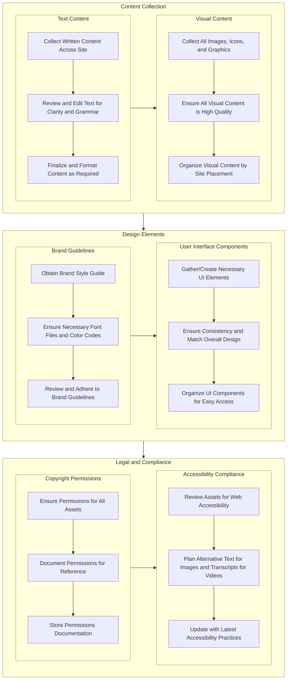

# Web Design Asset Collection Checklist

```table-of-contents
title: ## Contents 
style: nestedList # TOC style (nestedList|inlineFirstLevel)
minLevel: 1 # Include headings from the specified level
maxLevel: 4 # Include headings up to the specified level
includeLinks: true # Make headings clickable
debugInConsole: false # Print debug info in Obsidian console
```

## Overview

> [!SOURCE] Sources:
> - *[Asset Gathering Checklist for Web Design - Taskade](https://www.taskade.com/d/TVFf26r9kJrdb4tY)*

## Diagram



## Checklist

### 📝 Content Collection

- Text Content
    - [ ]  Gather all written content for each page of the site
    - [ ]  Review and edit the text for clarity and grammar
    - [ ]  Finalize and format the content as required (headings, lists, etc.)
- Visual Content
    - [ ]  Collect all images, icons, and graphics to be used on the site
    - [ ]  Ensure all visual content is high quality and appropriately formatted
    - [ ]  Organize visual content according to where it will be used on the site

### 🎨 Design Elements

- Brand Guidelines    
    - [ ]  Obtain the brand style guide, including fonts, colors, and logo usage
    - [ ]  Ensure you have all necessary font files and color codes
    - [ ]  Review brand guidelines and make sure all design elements adhere to it
- User Interface Components    
    - [ ]  Gather or create necessary UI elements like buttons, forms, and menus
    - [ ]  Check that UI components are consistent and match the overall design
    - [ ]  Organize UI components for easy access during the design process

### 🔒 Legal and Compliance

- Copyright Permissions
    - [ ]  Ensure you have the necessary permissions to use all provided assets
    - [ ]  Document all permissions for reference and legal protection
    - [ ]  Store all permissions documentation in a safe and accessible place
- Accessibility Compliance
    - [ ]  Review all assets to ensure they meet web accessibility guidelines
    - [ ]  Plan for alternative text for images and transcripts for videos if needed
    - [ ]  Keep up-to-date with latest accessibility best practices and requirements

## Conclusion

***

## Appendix

*Note created on [[2024-06-21]] and last modified on [[2024-06-21]].*

### See Also

- 

### Backlinks

```dataview
LIST FROM [[Checklist - Web Design Asset Collection]] AND -"CHANGELOG" AND -"04-RESOURCES/Checklists/Checklist - Web Design Asset Collection"
```

***

(c) [No Clocks, LLC](https://github.com/noclocks) | 2024
