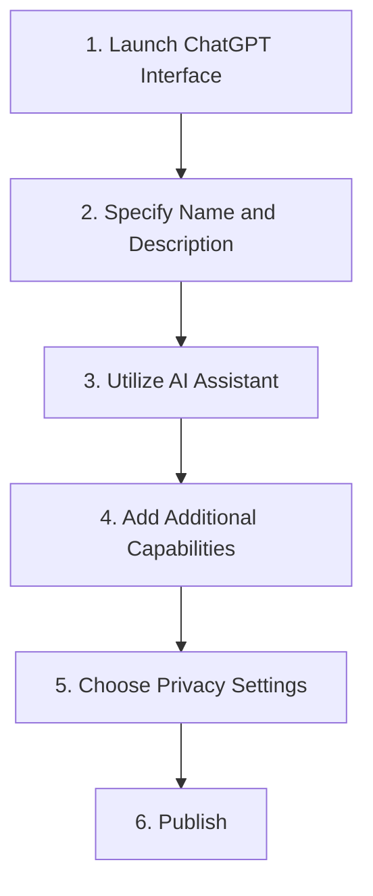

# Create Custom GPT Guide

```table-of-contents
title: Contents 
style: nestedList # TOC style (nestedList|inlineFirstLevel)
minLevel: 1 # Include headings from the specified level
maxLevel: 4 # Include headings up to the specified level
includeLinks: true # Make headings clickable
debugInConsole: false # Print debug info in Obsidian console
```

## Overview

> [!SOURCE] Sources:
> - *https://gpt-stores.com/sample-page/*

Creating a tailored [[Tool - ChatGPT|ChatGPT]] assistant is easy and can be done without coding:

1. Open [[Tool - ChatGPT|ChatGPT]] interface and click on `Create a GPT` to launch the interactive GPT Builder.
2. Give the GPT a name and description; Be clear on its intended purpose.
3. Start a conversation with the assistant to define the GPT's knowledge, skills, and how it should behave. Explain what you want it to be an expert in.
4. Specify additional capabilities like searching the web, analyzing data, or generating images/text. The builder will guide you in enabling APIs.
5. Choose privacy settings like whether your GPT's conversations can be used to train [[Tool - OpenAI|OpenAI]]'s models.
6. Publish your GPT either for personal use or submit it for inclusion in the GPT Store.




***

## Appendix

*Note created on [[2024-04-26]] and last modified on [[2024-04-26]].*

### Backlinks

```dataview
LIST FROM [[Guide - Create Custom GPT]] AND -"CHANGELOG" AND -"04-RESOURCES/Guides/Guide - Create Custom GPT"
```

***

(c) [No Clocks, LLC](https://github.com/noclocks) | 2024