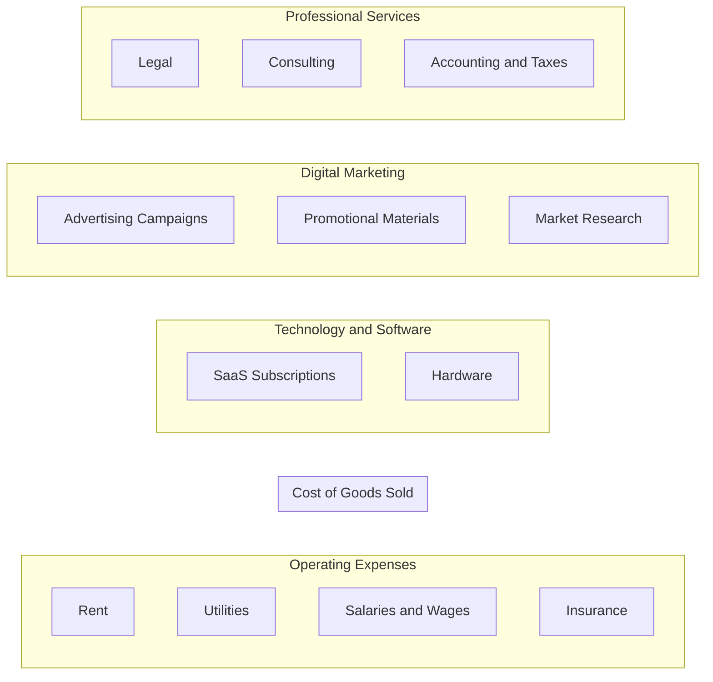

# Business Expense Categories Checklist

```table-of-contents
title: Contents 
style: nestedList # TOC style (nestedList|inlineFirstLevel)
minLevel: 1 # Include headings from the specified level
maxLevel: 4 # Include headings up to the specified level
includeLinks: true # Make headings clickable
debugInConsole: false # Print debug info in Obsidian console
```

## Overview

> [!SOURCE] Sources:
> - **

## Diagram



## Checklist

### Step 1

## Conclusion

***

## Appendix

*Note created on [[2024-04-02]] and last modified on [[2024-04-23]].*

### Backlinks

```dataview
LIST FROM [[Checklist - Business Expense Categories]] AND -"CHANGELOG" AND -"04-RESOURCES/Checklists/Checklist - Business Expense Categories"
```

***

(c) [No Clocks, LLC](https://github.com/noclocks) | 2024


# Business Expense Categories

-   Home Office Costs: https://www.irs.gov/businesses/small-businesses-self-employed/home-office-deduction
    -   $5 per square foot

-   Utilities
    -   Electricity
-   Legal:
-   Startup Expenses:
    -   Marketing
    -   Training
-   Office Supplies
    -   Paper
    -   Printer Ink
    -   Janitorial and cleaning supplies
    -   Computer Software and Subscriptions
    -   Internet Hosting
    -   Pens
-   Advertising:
    -   Google Ads
    -   Email Marketing Services
-   Website & Software:
    -   Domain Name Server
    -   Web Hosting
    -   Maintenance
-   Business Insurance
    -   General Liability Premium
-   Education:
    -   Classes and workshops intended to improve skills in your business’s field
    -   Subscriptions to professional publications
    -   Industry-related seminars, webinars, and retreats
    -   Books
    -   Online Courses