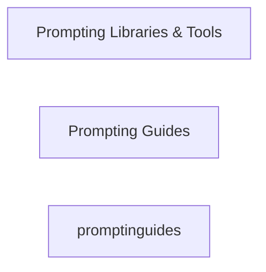

# AI Resources Master Resource List

```table-of-contents
title: Contents 
style: nestedList # TOC style (nestedList|inlineFirstLevel)
minLevel: 1 # Include headings from the specified level
maxLevel: 4 # Include headings up to the specified level
includeLinks: true # Make headings clickable
debugInConsole: false # Print debug info in Obsidian console
```

## Overview

> [!SOURCE] Sources:
> - *[Related resources from around the web | OpenAI Cookbook](https://cookbook.openai.com/articles/related_resources)*

> [!NOTE]
> Items with a ⭐ are "favorites" or "recommended" resources. 

> [!NOTE]
> All lists are displayed in alphabetical order.

## Diagram



## Prompt Engineering

### Libraries & Tools


- [Arthur Shield](https://www.arthur.ai/get-started): A paid product for detecting toxicity, hallucination, prompt injection, etc.
- [Baserun](https://baserun.ai/): A paid product for testing, debugging, and monitoring LLM-based apps
- [Chainlit](https://docs.chainlit.io/overview): A Python library for making chatbot interfaces.
- [Embedchain](https://github.com/embedchain/embedchain): A Python library for managing and syncing unstructured data with LLMs.
- [FLAML (A Fast Library for Automated Machine Learning & Tuning)](https://microsoft.github.io/FLAML/docs/Getting-Started/): A Python library for automating selection of models, hyperparameters, and other tunable choices.
- [Guardrails.ai](https://shreyar.github.io/guardrails/): A Python library for validating outputs and retrying failures. Still in alpha, so expect sharp edges and bugs.
- [Guidance](https://github.com/microsoft/guidance): A handy looking Python library from Microsoft that uses Handlebars templating to interleave generation, prompting, and logical control.
- [Haystack](https://github.com/deepset-ai/haystack): Open-source LLM orchestration framework to build customizable, production-ready LLM applications in Python.
- [HoneyHive](https://honeyhive.ai/): An enterprise platform to evaluate, debug, and monitor LLM apps.
- [LangChain](https://github.com/hwchase17/langchain): A popular Python/JavaScript library for chaining sequences of language model prompts.
- [LiteLLM](https://github.com/BerriAI/litellm): A minimal Python library for calling LLM APIs with a consistent format.
- [LlamaIndex](https://github.com/jerryjliu/llama_index): A Python library for augmenting LLM apps with data.
- [LMQL](https://lmql.ai/): A programming language for LLM interaction with support for typed prompting, control flow, constraints, and tools.
- [OpenAI Evals](https://github.com/openai/evals): An open-source library for evaluating task performance of language models and prompts.
- [Outlines](https://github.com/normal-computing/outlines): A Python library that provides a domain-specific language to simplify prompting and constrain generation.
- [Parea AI](https://www.parea.ai/): A platform for debugging, testing, and monitoring LLM apps.
- [Portkey](https://portkey.ai/): A platform for observability, model management, evals, and security for LLM apps.
- [Promptify](https://github.com/promptslab/Promptify): A small Python library for using language models to perform NLP tasks.
- [PromptPerfect](https://promptperfect.jina.ai/prompts): A paid product for testing and improving prompts.
- [Prompttools](https://github.com/hegelai/prompttools): Open-source Python tools for testing and evaluating models, vector DBs, and prompts.
- [Scale Spellbook](https://scale.com/spellbook): A paid product for building, comparing, and shipping language model apps.
- [Semantic Kernel](https://github.com/microsoft/semantic-kernel): A Python/C#/Java library from Microsoft that supports prompt templating, function chaining, vectorized memory, and intelligent planning.
- [Vellum](https://www.vellum.ai/): A paid AI product development platform to experiment with, evaluate, and deploy advanced LLM apps.
- [Weights & Biases](https://wandb.ai/site/solutions/llmops): A paid product for tracking model training and prompt engineering experiments.
- [YiVal](https://github.com/YiVal/YiVal): An open-source GenAI-Ops tool for tuning and evaluating prompts, retrieval configurations, and model parameters using customizable datasets, evaluation methods, and evolution strategies.


## Conclusion

***

## Appendix

*Note created on [[2024-04-29]] and last modified on [[2024-04-29]].*

### Backlinks

```dataview
LIST FROM [[AI Resources Master List]] AND -"CHANGELOG" AND -"//AI Resources Master List"
```

***

(c) [No Clocks, LLC](https://github.com/noclocks) | 2024
