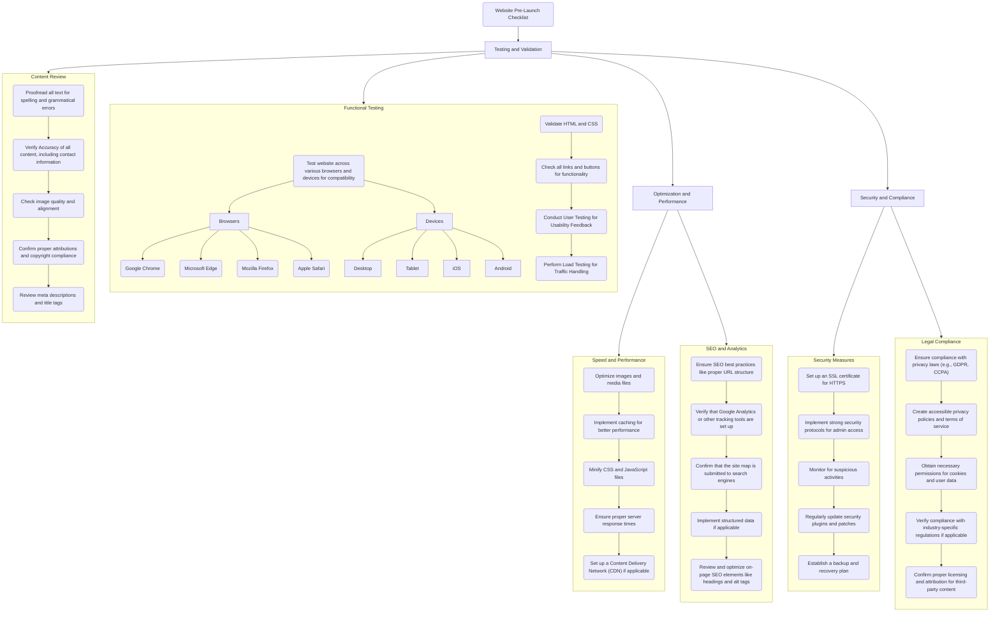

# Website Pre-Launch Checklist

```table-of-contents
title: ## Contents 
style: nestedList # TOC style (nestedList|inlineFirstLevel)
minLevel: 1 # Include headings from the specified level
maxLevel: 4 # Include headings up to the specified level
includeLinks: true # Make headings clickable
debugInConsole: false # Print debug info in Obsidian console
```

## Overview

> [!SOURCE] Sources:
> - *[Website Pre-Launch Checklist | Taskade](https://www.taskade.com/templates/design/website-pre-launch-checklist)*

1. Ensure that all links and pages are working correctly.
2. Optimize your website for search engines by using relevant keywords.
3. Check the website’s speed and optimize its performance.
4. Review and proofread all content on the website.
5. Ensure that the website is accessible to users with disabilities.
6. Test the website on different devices and browsers to ensure compatibility.

## Diagram



## Checklist

- [ ] Testing and Validation
	- [ ] Functional Testing
	- [ ] Content Review
- [ ] Optimization and Performance
	- [ ] Speed and Performance
	- [ ] SEO and Analytics
- [ ] Security and Compliance
	- [ ] Security Measures
	- [ ] Legal Compliance

### Testing and Validation

- [ ] Functional Testing
- [ ] Content Review

#### Functional Testing

- [ ] Test website across various browsers and devices for compatibility:
	- [ ] Browsers:
		- [ ] Google Chrome
		- [ ] Microsoft Edge
		- [ ] Mozilla Firefox
		- [ ] Apple Safari
	- [ ] Devices:
		- [ ] Desktop
		- [ ] Tablet
		- [ ] iOS
		- [ ] Android
- [ ] Validate HTML and CSS
- [ ] Check all links and buttons for functionality
- [ ] Conduct User Testing for Usability Feedback
- [ ] Perform Load Testing for Traffic Handling

#### Content Review

- [ ] Proofread all text for spelling and grammatical errors
- [ ] Verify Accuracy of all content, including contact information
- [ ] Check image quality and alignment
- [ ] Confirm proper attributions and copyright compliance
- [ ] Review meta descriptions and title tags

### Optimization and Performance

#### Speed and Performance

- [ ]  Optimize images and media files
- [ ]  Implement caching for better performance
- [ ]  Minify CSS and JavaScript files
- [ ]  Ensure proper server response times
- [ ]  Set up a Content Delivery Network (CDN) if applicable

#### SEO and Analytics
    
- [ ]  Ensure SEO best practices like proper URL structure
- [ ]  Verify that Google Analytics or other tracking tools are set up
- [ ]  Confirm that the site map is submitted to search engines
- [ ]  Implement structured data if applicable
- [ ]  Review and optimize on-page SEO elements like headings and alt tags

### Security and Compliance

#### Security Measures
    
- [ ]  Set up an SSL certificate for HTTPS
- [ ]  Implement strong security protocols for admin access
- [ ]  Monitor for suspicious activities
- [ ]  Regularly update security plugins and patches
- [ ]  Establish a backup and recovery plan

#### Legal Compliance

- [ ]  Ensure compliance with privacy laws (e.g., GDPR, CCPA)
- [ ]  Create accessible privacy policies and terms of service
- [ ]  Obtain necessary permissions for cookies and user data
- [ ]  Verify compliance with industry-specific regulations if applicable
- [ ]  Confirm proper licensing and attribution for third-party content


## Conclusion

***

## Appendix

*Note created on [[2024-05-01]] and last modified on [[2024-05-01]].*

### Backlinks

```dataview
LIST FROM [[Checklist - Website Pre-Launch]] AND -"CHANGELOG" AND -"04-RESOURCES/Lists/Checklists/Checklist - Website Pre-Launch"
```

***

(c) [No Clocks, LLC](https://github.com/noclocks) | 2024
