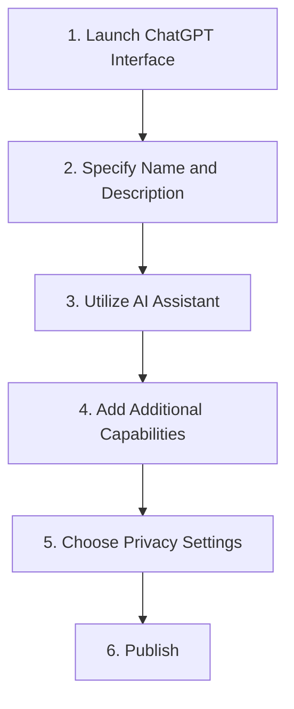

# Create Custom GPT Guide

```table-of-contents
title: Contents 
style: nestedList # TOC style (nestedList|inlineFirstLevel)
minLevel: 1 # Include headings from the specified level
maxLevel: 4 # Include headings up to the specified level
includeLinks: true # Make headings clickable
debugInConsole: false # Print debug info in Obsidian console
```

## Overview

> [!SOURCE] Sources:
> - *https://gpt-stores.com/sample-page/*

Creating a tailored [[Tool - ChatGPT|ChatGPT]] assistant is easy and can be done without coding:

1. Open [[Tool - ChatGPT|ChatGPT]] interface and click on `Create a GPT` to launch the interactive GPT Builder.
2. Give the GPT a name and description; Be clear on its intended purpose.
3. Start a conversation with the assistant to define the GPT's knowledge, skills, and how it should behave. Explain what you want it to be an expert in.
4. Specify additional capabilities like searching the web, analyzing data, or generating images/text. The builder will guide you in enabling APIs.
5. Choose privacy settings like whether your GPT's conversations can be used to train [[Tool - OpenAI|OpenAI]]'s models.
6. Publish your GPT either for personal use or submit it for inclusion in the GPT Store.



## Optimal Techniques for GPT Builders

Follow these recommended strategies to create GPTs that are both efficient and beneficial.

- Conduct thorough testing using various sample conversations to detect any shortcomings
- Continuously enhance the system based on the outcomes.
- Carefully check responses comply with OpenAI's content policy before publishing.
- Choose a specific objective and tailor instructions, information sources, and integrations accordingly.
- Provide sufficient domain-specific data/documents to make it an expert in that specialty.
- Having a predefined method for handling inaccurate replies to user questions is essential.
- Use feedback from early users to identify areas needing improvement.
- Regularly refresh it with new information, capabilities, and instructions as it advances.
- Emphasize the practical advantages and applications of your GPT by showcasing the specific benefits and scenarios it can assist with.

Following best practices will ensure your GPT provides a great user experience.

## Application of Custom GPTs

Once you have constructed your GPT, the opportunities for its utilization are boundless. Several instances of beneficial GPTs cater to diverse needs.

- **Productivity**: Enhance your productivity by utilizing a calendar scheduler, email helper, and writing/research assistant.
- **Education**: Improve your education with the assistance of academic tutors, homework/study aids, and subject-specific mentors.
- **Gaming**: Take your gaming experience to the next level with a companion for RPGs and a strategist for game advice.
- **Health/wellness**: Prioritize your health and wellness by utilizing a diet and fitness planner, as well as a chatbot for mental health support.
- **Domain expertise**: Access specialized knowledge and expertise through a SQL programming consultant and a specialist in legal research.
- **Everyday help**: Simplify your everyday tasks with the help of a travel planner, cooking assistant, and shopping advisor.

The key is to carefully design your GPT’s knowledge and capabilities around its intended purpose. Think through sample use cases and how to optimize its instructions and knowledge sources accordingly.

## Looking Ahead

GPTs mark only the initial phase of the potential for AI assistants to be tailored as specific tools seamlessly incorporated into our everyday routines.

- GPTs are expected to rapidly evolve and become more intelligent and capable as advancements in technology occur.
- They may take on real world tasks by interfacing with APIs, websites, and platforms.
- OpenAI plans to enhance the capabilities and safety of their models by taking user feedback into consideration from the usage of GPT.
- Financial incentives will motivate builders to create helpful GPTs as they can earn based on adoption.
- Businesses have the option to modify internal GPTs to suit their individualized business needs and utilize their proprietary data.
- Behind the scenes, GPTs will be utilized by developers to create third-party services and apps.
- As GPTs advance, it will be crucial to carefully consider ethics and societal adaptation.

GPTs represent a significant advancement in the development of AI assistants, offering users tailored assistance whenever needed.

## Conclusion

GPTs provide the opportunity for individuals to create personalized AI tools for specific purposes, eliminating the need for coding. The GPT Store facilitates effortless sharing of useful creations among the community.

By providing straightforward guidance, you have the power to customize every aspect of your personal GPT, including its knowledge, behavior, and capabilities. The potential is limitless. You can choose to make your GPT accessible to the public or keep it confidential.

With the advancement of GPTs, new opportunities arise for individuals to actively contribute to the development of AI by showcasing practical examples of useful applications. GPTs mark the initial stage of a growing trend towards highly customizable AI assistants. We strongly urge you to begin crafting and exchanging your own specialized GPTs right away!

## Resources

- [[Tool - OpenAI|OpenAI]]
- [[Tool - ChatGPT|ChatGPT]]
- [[Chatbot]]
- [[Artificial Intelligence (AI)]]
- [[MOC - Artificial Intelligence|Artificial Intelligence MOC]]

***

## Appendix

*Note created on [[2024-04-26]] and last modified on [[2024-04-26]].*

### Backlinks

```dataview
LIST FROM [[Guide - Create Custom GPT]] AND -"CHANGELOG" AND -"04-RESOURCES/Guides/Guide - Create Custom GPT"
```

***

(c) [No Clocks, LLC](https://github.com/noclocks) | 2024