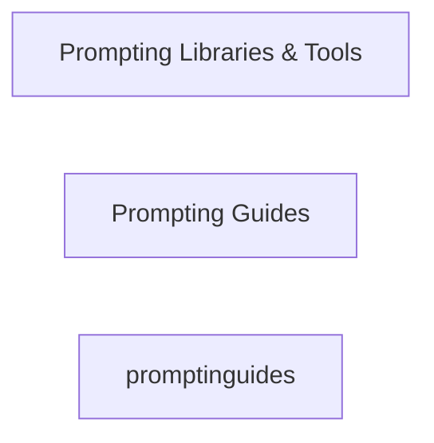

# AI Resources Master Resource List

```table-of-contents
title: Contents 
style: nestedList # TOC style (nestedList|inlineFirstLevel)
minLevel: 1 # Include headings from the specified level
maxLevel: 4 # Include headings up to the specified level
includeLinks: true # Make headings clickable
debugInConsole: false # Print debug info in Obsidian console
```

## Overview

> [!SOURCE] Sources:
> - *[Related resources from around the web | OpenAI Cookbook](https://cookbook.openai.com/articles/related_resources)*

> [!NOTE]
> Items with a ⭐ are "favorites" or "recommended" resources. 

> [!NOTE]
> All lists are displayed in alphabetical order.

- Libraries & Tools
- Guides
- Videos
- Papers

## Diagram



## Prompt Engineering

- [Examples - OpenAI API](https://platform.openai.com/examples)

### Libraries & Tools

| Name                                                         | Note | Rating | Description                                                  |
| ------------------------------------------------------------ | ---- | ------ | ------------------------------------------------------------ |
| [Arthur Shield](https://www.arthur.ai/get-started)           |      | `N/A`  | A paid product for detecting toxicity, hallucination, prompt injection, etc. |
| [Baserun](https://baserun.ai/)                               |      | `N/A`  | A paid product for testing, debugging, and monitoring LLM-based apps |
| [Chainlit](https://docs.chainlit.io/overview)                | [[Tool - Python Chainlit\|Chainlit]]     | ⭐⭐     | A Python library for making chatbot interfaces.              |
| [Embedchain](https://github.com/embedchain/embedchain)       | [[Tool - Python Embedchain\|Embedchain]]     | ⭐⭐     | A Python library for managing and syncing unstructured data with LLMs. |
| [FLAML](https://microsoft.github.io/FLAML/docs/Getting-Started/) |      | `N/A`  | A Python library for automating selection of models, hyperparameters, and other tunable choices. |
| [Guardrails.ai](https://shreyar.github.io/guardrails/)       |      | `N/A`  | A Python library for validating outputs and retrying failures. Still in alpha. |
| [Guidance](https://github.com/microsoft/guidance)            |      | `N/A`  | A Python library from Microsoft using Handlebars templating. |
| [Haystack](https://github.com/deepset-ai/haystack)           |      | `N/A`  | Open-source LLM orchestration framework.                     |
| [HoneyHive](https://honeyhive.ai/)                           |      | `N/A`  | An enterprise platform to evaluate, debug, and monitor LLM apps. |
| [LangChain](https://github.com/hwchase17/langchain)          | [[Tool - Python Langchain|Langchain]]     | ⭐⭐⭐    | A popular Python/JavaScript library for chaining language model prompts. |
| [LiteLLM](https://github.com/BerriAI/litellm)                |      | `N/A`  | A minimal Python library for calling LLM APIs.               |
| [LlamaIndex](https://github.com/jerryjliu/llama_index)       | [[Tool - Python LlamaIndex|LlamaIndex]]     | ⭐⭐⭐    | A Python library for augmenting LLM apps with data.          |
| [LMQL](https://lmql.ai/)                                     |      | `N/A`  | A programming language for LLM interaction with various supports. |
| [OpenAI Evals](https://github.com/openai/evals)              |      | `N/A`  | An open-source library for evaluating language models and prompts. |
| [Outlines](https://github.com/normal-computing/outlines)     |      | `N/A`  | A Python library for simplifying prompting and constraining generation. |
| [Parea AI](https://www.parea.ai/)                            |      | `N/A`  | A platform for debugging, testing, and monitoring LLM apps.  |
| [Portkey](https://portkey.ai/)                               |      | `N/A`  | A platform for observability and management in LLM apps.     |
| [Promptify](https://github.com/promptslab/Promptify)         |      | ⭐      | A small Python library for using language models in NLP tasks. |
| [PromptPerfect](https://promptperfect.jina.ai/prompts)       |      | ⭐      | A paid product for testing and improving prompts.            |
| [Prompttools](https://github.com/hegelai/prompttools)        |      | ⭐⭐     | Open-source Python tools for testing and evaluating models.  |
| [Scale Spellbook](https://scale.com/spellbook)               |      | ⭐⭐⭐    | A paid product for building and shipping language model apps. |
| [Semantic Kernel](https://github.com/microsoft/semantic-kernel) |      | `N/A`  | A library from Microsoft supporting prompt templating and more. |
| [Vellum](https://www.vellum.ai/)                             |      | `N/A`  | A paid AI product development platform for LLM apps.         |
| [Weights & Biases](https://wandb.ai/site/solutions/llmops)   |      | `N/A`  | A paid product for tracking model training and prompt engineering. |
| [YiVal](https://github.com/YiVal/YiVal)                      |      | `N/A`  | An open-source GenAI-Ops tool for tuning and evaluating prompts and more. |

### Guides

- [Brex's Prompt Engineering Guide](https://github.com/brexhq/prompt-engineering): Brex's introduction to language models and prompt engineering.
- [learnprompting.org](https://learnprompting.org/): An introductory course to prompt engineering.
- [Lil'Log Prompt Engineering](https://lilianweng.github.io/posts/2023-03-15-prompt-engineering/): An OpenAI researcher's review of the prompt engineering literature (as of March 2023).
- [OpenAI Cookbook: Techniques to improve reliability](https://cookbook.openai.com/articles/techniques_to_improve_reliability): A slightly dated (Sep 2022) review of techniques for prompting language models.
- [promptingguide.ai](https://www.promptingguide.ai/): A prompt engineering guide that demonstrates many techniques.
- [Xavi Amatriain's Prompt Engineering 101 Introduction to Prompt Engineering](https://amatriain.net/blog/PromptEngineering) and [202 Advanced Prompt Engineering](https://amatriain.net/blog/prompt201): A basic but opinionated introduction to prompt engineering and a follow up collection with many advanced methods starting with CoT.

### Academic Papers

- [Chain-of-Thought Prompting Elicits Reasoning in Large Language Models (2022)](https://arxiv.org/abs/2201.11903): Using few-shot prompts to ask models to think step by step improves their reasoning. PaLM's score on math word problems (GSM8K) rises from 18% to 57%.
- [Self-Consistency Improves Chain of Thought Reasoning in Language Models (2022)](https://arxiv.org/abs/2203.11171): Taking votes from multiple outputs improves accuracy even more. Voting across 40 outputs raises PaLM's score on math word problems further, from 57% to 74%, and `code-davinci-002`'s from 60% to 78%.
- [Tree of Thoughts: Deliberate Problem Solving with Large Language Models (2023)](https://arxiv.org/abs/2305.10601): Searching over trees of step by step reasoning helps even more than voting over chains of thought. It lifts `GPT-4`'s scores on creative writing and crosswords.
- [Language Models are Zero-Shot Reasoners (2022)](https://arxiv.org/abs/2205.11916): Telling instruction-following models to think step by step improves their reasoning. It lifts `text-davinci-002`'s score on math word problems (GSM8K) from 13% to 41%.
- [Large Language Models Are Human-Level Prompt Engineers (2023)](https://arxiv.org/abs/2211.01910): Automated searching over possible prompts found a prompt that lifts scores on math word problems (GSM8K) to 43%, 2 percentage points above the human-written prompt in Language Models are Zero-Shot Reasoners.
- [Reprompting: Automated Chain-of-Thought Prompt Inference Through Gibbs Sampling (2023)](https://arxiv.org/abs/2305.09993): Automated searching over possible chain-of-thought prompts improved ChatGPT's scores on a few benchmarks by 0–20 percentage points.
- [Faithful Reasoning Using Large Language Models (2022)](https://arxiv.org/abs/2208.14271): Reasoning can be improved by a system that combines: chains of thought generated by alternative selection and inference prompts, a halter model that chooses when to halt selection-inference loops, a value function to search over multiple reasoning paths, and sentence labels that help avoid hallucination.
- [STaR: Bootstrapping Reasoning With Reasoning (2022)](https://arxiv.org/abs/2203.14465): Chain of thought reasoning can be baked into models via fine-tuning. For tasks with an answer key, example chains of thoughts can be generated by language models.
- [ReAct: Synergizing Reasoning and Acting in Language Models (2023)](https://arxiv.org/abs/2210.03629): For tasks with tools or an environment, chain of thought works better if you prescriptively alternate between **Re**asoning steps (thinking about what to do) and **Act**ing (getting information from a tool or environment).
- [Reflexion: an autonomous agent with dynamic memory and self-reflection (2023)](https://arxiv.org/abs/2303.11366): Retrying tasks with memory of prior failures improves subsequent performance.
- [Demonstrate-Search-Predict: Composing retrieval and language models for knowledge-intensive NLP (2023)](https://arxiv.org/abs/2212.14024): Models augmented with knowledge via a "retrieve-then-read" can be improved with multi-hop chains of searches.
- [Improving Factuality and Reasoning in Language Models through Multiagent Debate (2023)](https://arxiv.org/abs/2305.14325): Generating debates between a few ChatGPT agents over a few rounds improves scores on various benchmarks. Math word problem scores rise from 77% to 85%.

## Conclusion

***

## Appendix

*Note created on [[2024-04-29]] and last modified on [[2024-04-29]].*

### Backlinks

```dataview
LIST FROM [[AI Resources Master List]] AND -"CHANGELOG" AND -"//AI Resources Master List"
```

***

(c) [No Clocks, LLC](https://github.com/noclocks) | 2024
